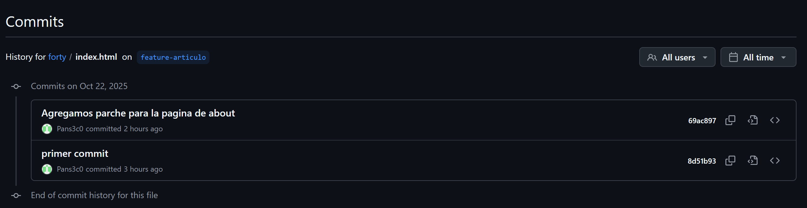

# Ejercicio Forty

# Trabajo en local

1. Inicializa un nuevo repositorio Git en una carpeta llamada
proporcionados en el aula virtual.
    
    ```jsx
    git init
    
    ```
    
2. Renombra la rama master a
main
    
    ```jsx
    git branch -m main
    ```
    
3. Haz que los ficheros
    
    ```jsx
    git rm --cached README.txt
    git rm --cached LICENSE.txt
    git rm --cached passwords.txt
    ```
    
    o
    
    ```jsx
    code .gitignore
    echo `passwords.txt` > .gitignore
    echo `README.txt` >> .gitignore
    ```
    
4. Crea el archivo
passwords.txt. Comprueba que el control de versiones lo ignora
    
    ```jsx
    echo `juanjo` > password.txt
    git add .
    git status
    ```
    
5. Crea una rama llamada
"feature-content". Muévete a esa rama. Cambia, en la línea 3477, el
font-size por
1.5em en el archivo
de la forma más gráfica posible.
main.css. Confirma cambios y haz commit. Muestra los logs
    
    ```jsx
    git checkout -b feature-content
    git add .
    git status
    git commit -m "Cambios en el css"
    git log --graph
    ```
    
    o
    

```jsx
git branch feature-content
git checkout feature-content
git add .
git status
git commit -m "Cambios en el css"
git log --graph

```

```jsx
PS C:\Users\Pacheco\Downloads\Ejercicios Forty-20251017\forty\assets> git commit -m "Cambios en el main.css de 1.5em"
[feature-content c3ecd57] Cambios en el main.css de 1.5em
 2 files changed, 3792 insertions(+), 3708 deletions(-)
PS C:\Users\Pacheco\Downloads\Ejercicios Forty-20251017\forty\assets> git log
commit c3ecd570f52e67ad9f8e76124bf9550a483ad639 (HEAD -> feature-content)
Author: Pacheco <samupachebq@gmail.com>
Date:   Wed Oct 22 10:20:15 2025 +0200

    Cambios en el main.css de 1.5em

commit b42dfa3de3ec210d3f44bd2d3169c76a8ac793a4 (main)
Author: Pacheco <samupachebq@gmail.com>
Date:   Wed Oct 22 10:00:19 2025 +0200
```

1. Elimina el archivo
"passwords.txt" en la carpeta
forty. Verifica el estado del repositorio. ¿Hay
Página 1 de 3
cambios pendientes?
    
    ```jsx
    rm password.txt
    git add .
    git status ()=> "No se encontraron cambios"
    ```
    
2. Crea un nuevo archivo llamado "
about.html", partiendo del archivo
repositorio, haz un nuevo commit.
    
    ```jsx
    git add .
    git commit -m "Creando nuevo archivo"
    ```
    
3. Cambia a la rama
generic.html y agrégalo al
main. Examina los logs del repositorio de forma gráfica.

```jsx
PS C:forty> git log --graph --all
* commit 4289c780577015ba9c8c30e2cfaa076849271f8d (HEAD -> main)
| Author: Pacheco <samupachebq@gmail.com>
| Date:   Wed Oct 22 10:41:09 2025 +0200
|
|     Modificamos el archivo de generic
|
| * commit c3ecd570f52e67ad9f8e76124bf9550a483ad639 (feature-content)
|/  Author: Pacheco <samupachebq@gmail.com>
|   Date:   Wed Oct 22 10:20:15 2025 +0200
|
|       Cambios en el main.css de 1.5em
|
* commit b42dfa3de3ec210d3f44bd2d3169c76a8ac793a4
| Author: Pacheco <samupachebq@gmail.com>
| Date:   Wed Oct 22 10:00:19 2025 +0200
|
|     Segunda parte
|
* commit 8d51b93f2200445fe4a42cbca6dafe1925befeb9
  Author: Pacheco <samupachebq@gmail.com>
  Date:   Wed Oct 22 09:55:47 2025 +0200

      primer commit
PS C:\forty>
```

1. Modifica algo en el archivo
generic.html, comprueba que hay cambios, y realiza otro commit .
Examina los logs del repositorio de forma gráfica.
    
    ```jsx
    git add .
    git status
    git commit -m "Cambiamos generic"
    git log --graph --all
    ```
    
2. Modifica algo en el fichero
elements.html. Confirma los cambios, pero no hagas commit.
    
    ```jsx
    git diff
    ```
    
3. Mira las diferencias de
elements.html. Los cambios no nos gustan, deshaz los cambios de
elements.html. Comprueba que no hay cambios pendientes.
    
    ```jsx
    git diff
    git checkout -- elements.html
    ```
    
4. Muestra las diferencias entre dos ramas.
    
    ```jsx
    git diff main feature-content
    ```
    
5. Fusiona la rama
"feature-content" con la rama principal (main). Muestra los logs del
repositorio de una forma gráfica y completa.
    
    ```jsx
    git checkout main
    git merge feature-content
    git log --graph --all
    ```
    
    ```jsx
    PS C:\Users\Pacheco\Downloads\Ejercicios Forty-20251017\forty\assets> git log --graph --all
    * commit c3ecd570f52e67ad9f8e76124bf9550a483ad639 (feature-content)
    | Author: Pacheco <samupachebq@gmail.com>
    | Date:   Wed Oct 22 10:20:15 2025 +0200
    |
    |     Cambios en el main.css de 1.5em
    |
    * commit b42dfa3de3ec210d3f44bd2d3169c76a8ac793a4 (HEAD -> main)
    | Author: Pacheco <samupachebq@gmail.com>
    | Date:   Wed Oct 22 10:00:19 2025 +0200
    |
    |     Segunda parte
    |
    * commit 8d51b93f2200445fe4a42cbca6dafe1925befeb9
      Author: Pacheco <samupachebq@gmail.com>
      Date:   Wed Oct 22 09:55:47 2025 +0200
    
          primer commit
    ```
    
6. Crea una nueva rama llamada "
hotfix" y en ella, corrige un error crítico en el archivo
"i
ndex.html". (Por ejemplo, añade el enlace a la nueva página about.html)
    
    ```jsx
    git checkout -b hotfix
    git add .
    git commit -m "Hemos creado la ruta de acceso a about"
    ```
    
7. Fusiona la rama
"hotfix" con la rama principal y verifica el historial de commits de forma que se
vean todas las ramas gráficamente. ¿Borrarías la rama
hotfix? ¿En qué caso? ¿Cómo?
    
    ```jsx
    git checkout main
    git merge hotfix
    ```
    
8. Muestra el historial de cambios limitado a los últimos 3 commits.
    
    ```jsx
    git log -n 3
    ```
    
9. Etiqueta el commit actual como "v1.0" y muestra las etiquetas existentes.
Página 2 de 3
    
    ```jsx
    git tag V1.0
    git tag
    ```
    

# Trabajo en remoto

1. Sube al remoto los ficheros de tu repositorio local.
Es necesario crear previamente en GitHub un repositorio llamado 'forty'
NO crear archivo [README.md](http://readme.md/) en el remoto
    
    ```jsx
    git remote add origin https://github.com/Pans3c0/forty.git
    git branch -M main
    git push -u origin main
    ```
    
2. En local, crea una rama 'feature-head'. Cambia el título en la sección
los comentarios del
head de
index.html, borra
head , o previos, también. Confirma y sube los cambios al remoto.
    
    ```jsx
    git checkout -b feature-head
    git add .
    git commit -m "Cambios aplicados correctamente"
    git push origin feature-head
    ```
    
3. En remoto, crea una rama 'feature-articulo'. Duplica la página
generic , nómbrala como
articulo.html, y añade como contenido un artículo sobre Git. Confirma los cambios y realiza un
commit. Muestra los commits del repositorio tal como se ven en GitHub.
    
    ```powershell
    git checkout main
    git checkout -b feature-articulo
    git add articulo.html
    git commit -m "feat: Añade articulo.html sobre Git"
    ```
    
4. En el repositorio local examina los cambios. Actualiza el repositorio con el remoto. Fusiona en
'main' las dos ramas 'feature'. Crea la etiqueta 'v2.0'. Muestra los logs, commits, etiquetas y
ramas actuales, en local y en remoto
    
    ```jsx
    PS C:\Users\Pacheco\Downloads\Ejercicios Forty-20251017\forty> git log --graph --all
    *   commit bf6d1d9d3a8ab52dbe6c41004cf323b174a8e25e (HEAD -> main)
    |\  Merge: d948e50 d24a60c
    | | Author: Pacheco <samupachebq@gmail.com>
    | | Date:   Wed Oct 22 12:55:27 2025 +0200
    | |
    | |     Merge remote-tracking branch 'origin/feature-articulo'
    | |
    | * commit d24a60cf6fd16dcad8d1fccf4d2523e070700d88 (origin/feature-articulo)
    | | Author: Pans3c0 <78103748+Pans3c0@users.noreply.github.com>
    | | Date:   Wed Oct 22 12:45:02 2025 +0200
    | |
    | |     Creacion de articulo.html
    | |
    * | commit d948e5067977d45580a8208d62dc1eef7590a769 (origin/feature-head, feature-head)
    |/  Author: Pacheco <samupachebq@gmail.com>
    |   Date:   Wed Oct 22 11:43:41 2025 +0200
    |
    |       cambio del header de index.html
    |
    * commit 69ac897401ed9524587ba5b0e8bd8fa135515320 (tag: V1.0, origin/main, origin/HEAD, hotfix)
    | Author: Pacheco <samupachebq@gmail.com>
    | Date:   Wed Oct 22 11:24:41 2025 +0200
    |
    |     Agregamos parche para la pagina de about
    |
    *   commit 88adc6d7167b85f4d11c7370d94f2855266fff6a
    |\  Merge: 4289c78 c3ecd57
    | | Author: Pacheco <samupachebq@gmail.com>
    | | Date:   Wed Oct 22 11:07:49 2025 +0200
    | |
    | |     Merge branch 'feature-content'
    | |
    | * commit c3ecd570f52e67ad9f8e76124bf9550a483ad639 (feature-content)
    | | Author: Pacheco <samupachebq@gmail.com>
    | | Date:   Wed Oct 22 10:20:15 2025 +0200
    | |
    | |     Cambios en el main.css de 1.5em
    | |
    * | commit 4289c780577015ba9c8c30e2cfaa076849271f8d
    |/  Author: Pacheco <samupachebq@gmail.com>
    |   Date:   Wed Oct 22 10:41:09 2025 +0200
    |
    |       Modificamos el archivo de generic
    |
    * commit b42dfa3de3ec210d3f44bd2d3169c76a8ac793a4
    | Author: Pacheco <samupachebq@gmail.com>
    | Date:   Wed Oct 22 10:00:19 2025 +0200
    |
    |     Segunda parte
    |
    * commit 8d51b93f2200445fe4a42cbca6dafe1925befeb9
      Author: Pacheco <samupachebq@gmail.com>
      Date:   Wed Oct 22 09:55:47 2025 +0200
    
    ```
    
5. En tu copia local, crea una rama
nueva. En la rama nueva, cambia los enlaces de la página
index.html para que apunten correctamente a la nueva página
cambios.
articulo.html. Confirma los
    
    ```jsx
    git cheackout -b articulo-nuevo
    git add .
    git commit -m "Añadimos la ruta de articulo en index"
    
    ```
    
6. Muestra los logs de forma que se vean las ramas en tu copia local.
    
    ```jsx
    PS C:\Users\Pacheco\Downloads\Ejercicios Forty-20251017\forty> git log --graph --all
    * commit 7ad25908b85893dbf3af22d79b0b89e388ae9014 (HEAD -> articulo-nuevo)
    | Author: Pacheco <samupachebq@gmail.com>
    | Date:   Wed Oct 22 13:07:09 2025 +0200
    |
    |     Añadimos la ruta de articulo en index
    |
    *   commit bf6d1d9d3a8ab52dbe6c41004cf323b174a8e25e (tag: V2.0, main)
    |\  Merge: d948e50 d24a60c
    | | Author: Pacheco <samupachebq@gmail.com>
    | | Date:   Wed Oct 22 12:55:27 2025 +0200
    | |
    | |     Merge remote-tracking branch 'origin/feature-articulo'
    | |
    | * commit d24a60cf6fd16dcad8d1fccf4d2523e070700d88 (origin/feature-articulo)
    | | Author: Pans3c0 <78103748+Pans3c0@users.noreply.github.com>
    | | Date:   Wed Oct 22 12:45:02 2025 +0200
    | |
    | |     Creacion de articulo.html
    | |
    * | commit d948e5067977d45580a8208d62dc1eef7590a769 (origin/feature-head, feature-head)
    |/  Author: Pacheco <samupachebq@gmail.com>
    |   Date:   Wed Oct 22 11:43:41 2025 +0200
    |
    |       cambio del header de index.html
    |
    * commit 69ac897401ed9524587ba5b0e8bd8fa135515320 (tag: V1.0, origin/main, origin/HEAD, hotfix)
    | Author: Pacheco <samupachebq@gmail.com>
    | Date:   Wed Oct 22 11:24:41 2025 +0200
    |
    |     Agregamos parche para la pagina de about
    |
    *   commit 88adc6d7167b85f4d11c7370d94f2855266fff6a
    |\  Merge: 4289c78 c3ecd57
    | | Author: Pacheco <samupachebq@gmail.com>
    | | Date:   Wed Oct 22 11:07:49 2025 +0200
    | |
    | |     Merge branch 'feature-content'
    | |
    | * commit c3ecd570f52e67ad9f8e76124bf9550a483ad639 (feature-content)
    | | Author: Pacheco <samupachebq@gmail.com>
    | | Date:   Wed Oct 22 10:20:15 2025 +0200
    | |
    | |     Cambios en el main.css de 1.5em
    | |
    * | commit 4289c780577015ba9c8c30e2cfaa076849271f8d
    |/  Author: Pacheco <samupachebq@gmail.com>
    |   Date:   Wed Oct 22 10:41:09 2025 +0200
    |
    |       Modificamos el archivo de generic
    |
    * commit b42dfa3de3ec210d3f44bd2d3169c76a8ac793a4
    | Author: Pacheco <samupachebq@gmail.com>
    | Date:   Wed Oct 22 10:00:19 2025 +0200
    |
    |     Segunda parte
    |
    * commit 8d51b93f2200445fe4a42cbca6dafe1925befeb9
      Author: Pacheco <samupachebq@gmail.com>
      Date:   Wed Oct 22 09:55:47 2025 +0200
    
          primer commit
    ```
    
7. Te gusta el resultado de los cambios. Incorpora los cambios de la rama nueva a la principal.
    
    ```jsx
    git checkout main
    git merge articulo-nuevo
    ```
    
8. Sube los cambios al remoto borrando la rama
nueva, si es necesario. Comprueba primero con un
comando en local, las ramas que hay en el repositorio remoto.
    
    ```jsx
    git push origin main
    git push --tags
    git branch -d articulo-nuevo
    ```
    
    1. Nuestra en local los cambios en el archivo
    index.html entre la versión actual y la anterior.
    
    ```jsx
    PS C:\Users\Pacheco\Downloads\Ejercicios Forty-20251017\forty> git diff HEAD~1 HEAD index.html
    diff --git a/index.html b/index.html
    index 461a1a9..1adf860 100644
    --- a/index.html
    +++ b/index.html
    @@ -22,9 +22,7 @@
         <div id="wrapper">
           <!-- Header -->
           <header id="header" class="alt">
    -        <a href="index.html" class="logo"
    -          ><strong>Pachhhh</strong> </a
    -        >
    +        <a href="index.html" class="logo"><strong>Pachhhh</strong> </a>
             <nav>
               <a href="#menu">Menu</a>
             </nav>
    @@ -37,7 +35,8 @@
               <li><a href="landing.html">Landing</a></li>
               <li><a href="generic.html">Generic</a></li>
               <li><a href="elements.html">Elements</a></li>
    -          <li><a href="abour.html">About</a></li>
    +          <li><a href="about.html">About</a></li>
    +          <li><a href="articulo.html">Articulo</a></li>
             </ul>
             <ul class="actions stacked">
               <li><a href="#" class="button primary fit">Get Started</a></li>
    ```
    

1. En el repositorio en GitHub, navega hasta el archivo index.html y selecciona la opción "History".



---