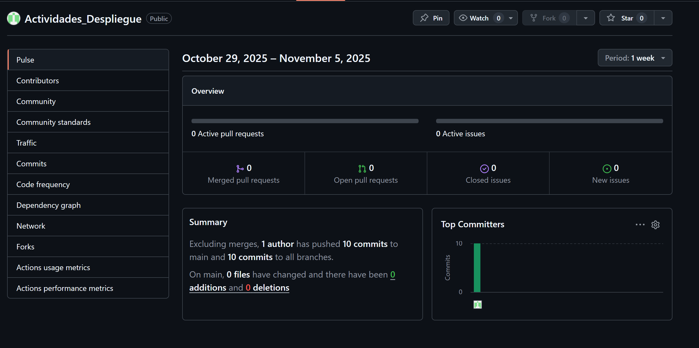

# Repositorios Despliegue

### Hecho por: Samuel Edgar Pacheco Velin

Este repositorio contiene:

- Ejercicios de repaso de Linux.
- El ejercicio "Forty" resuelto con comandos.
- El ejercicio “Forty” resuelto con interfaz gráfica.

### Enlace al repo de github

https://github.com/Pans3c0/Actividades_Despliegue

### Imagen del Insights

